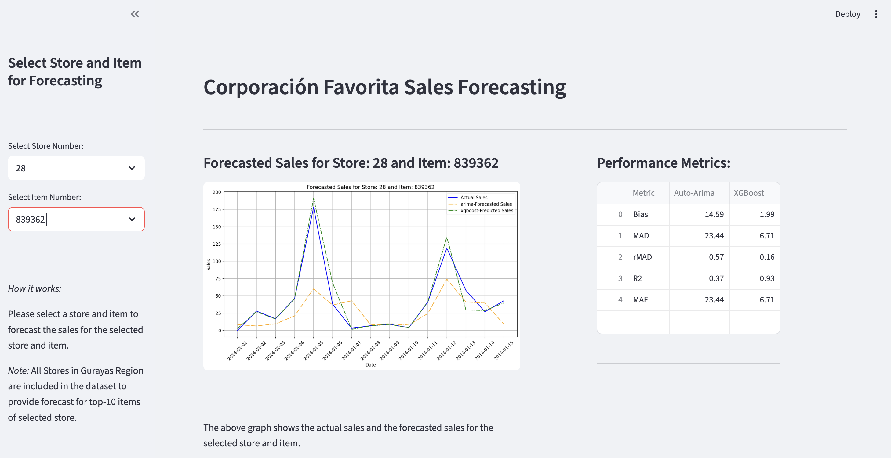

# Forecasting_App

A Streamlit web application for visualizing and forecasting sales for top items in stores using time series models (Auto ARIMA, XGBoost). The app allows users to select a store and item to view actual and forecasted sales, leveraging precomputed forecasts.

---

## Features

- **Interactive UI:** Select store and item from sidebar.
- **Sales Forecast Visualization:** Compare actual sales with forecasts from Auto ARIMA and XGBoost models.
- **Top Items:** Focuses on top-10 items per store.
- **Modern Layout:** Clean, wide layout with side-by-side plots and controls.

---

## Project Structure
app.py ReadMe.md requirements.txt 
forecasts/ stores_forecasts_15_updated.json forcasts/ stores_forecasts_90_updated.json


- `app.py`: Main Streamlit application.
- `forecasts/`: Contains precomputed forecast data in JSON format.
- `requirements.txt`: Python dependencies.
- `ReadMe.md`: Project documentation.

---

## Getting Started

### Prerequisites

- Python 3.8+
- [pip](https://pip.pypa.io/en/stable/)

### Installation

1. **Clone the repository:**
    ```sh
    git clone https://github.com/yourusername/Forecasting_App.git
    cd Forecasting_App
    ```

2. **Install dependencies:**
    ```sh
    pip install -r requirements.txt
    ```

3. **Run the app:**
    ```sh
    streamlit run app.py
    ```

---

## Usage

1. Launch the app as above.
2. Use the sidebar to select a store and an item.
3. View the forecasted and actual sales plots for the selected item.
4. Explore different stores and items as needed.

---

## Data

- Forecast data is stored in the `forecasts/` directory as JSON files.
- Each file contains forecast results for multiple stores and items, including actual sales and predictions from different models.

---

## Screenshots

*Add screenshots here to showcase the UI and plots.*
**

---

## Contributing

Contributions are welcome! Please open issues or submit pull requests for improvements or bug fixes.

---

## License

*Specify your license here (e.g., MIT, Apache 2.0).*

---

## Acknowledgements

- [Streamlit](https://streamlit.io/)
- [pandas](https://pandas.pydata.org/)
- [matplotlib](https://matplotlib.org/)
- [scikit-learn](https://scikit-learn.org/)
- [xgboost](https://xgboost.readthedocs.io/)

---