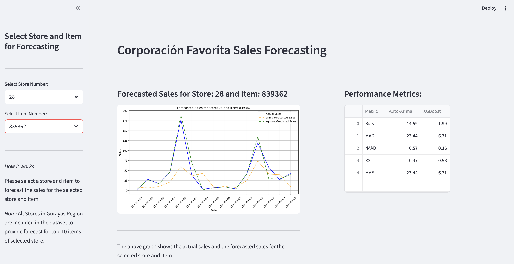

# Retail Demand Forecast

A comprehensive project for forecasting retail demand using time series analysis and machine learning. This repository includes data preprocessing, exploratory data analysis, model training, evaluation, and a Streamlit web application for interactive forecasting visualization.

## Project Structure

```
Retail_Demand_Forecast/
│
├── data/                       # Raw and processed datasets (not tracked in git)
├── notebooks/                  # Jupyter notebooks for EDA, modeling, and experiments
├── src/                        # Source code for data processing and modeling
├── Forecasting_app/            # Streamlit app for interactive forecasting
│   ├── app.py
│   └── forecasts/
├── mlflow_results/             # MLflow experiment tracking results (ignored in git)
├── Data_Kaggel_&_Guayas/     # External data sources (ignored in git)
├── requirements.txt            # Python dependencies
├── README.md                   # Project documentation
└── .gitignore
```

## Features

- **Data Preprocessing:** Scripts and notebooks for cleaning and preparing retail sales data.
- **Exploratory Data Analysis:** Visualizations and insights into sales trends, seasonality, and anomalies.
- **Modeling:** Implementation of various forecasting models (ARIMA, Prophet, XGBoost, etc.).
- **Evaluation:** Metrics and plots to compare model performance.
- **Experiment Tracking:** MLflow integration for reproducible experiments.
- **Web App:** Streamlit-based app for interactive forecast visualization by store and item.

## Getting Started

1. **Clone the repository:**
    ```sh
    git clone https://github.com/yourusername/Retail_Demand_Forecast.git
    cd Retail_Demand_Forecast
    ```

2. **Install dependencies:**
    ```sh
    pip install -r requirements.txt
    ```

3. **Prepare data:**
    - Place raw data in the `data/` folder.
    - (Optional) Add external data to `Data_Kaggel_&_Guarayas/`.

4. **Run notebooks:**
    - Explore EDA and modeling in the `notebooks/` directory.

5. **Launch the forecasting app:**
    ```sh
    cd Forecasting_app
    streamlit run app.py
    ``` 
## Screenshots

*Add screenshots here to showcase the UI and plots.*
**


## Requirements

- Python 3.7+
- See `requirements.txt` for full list

## Notes

- Large data and results folders (`data/`, `mlflow_results/`, `Data_Kaggel_&_Guarayas/`) are excluded from version control.
- Forecasting app expects precomputed forecasts in `Forecasting_app/forecasts/`.

## License

This project is for educational and research purposes.

## Acknowledgements

- Corporación Favorita Grocery Sales Forecasting (Kaggle)
- Facebook Prophet, XGBoost, scikit-learn, Streamlit
